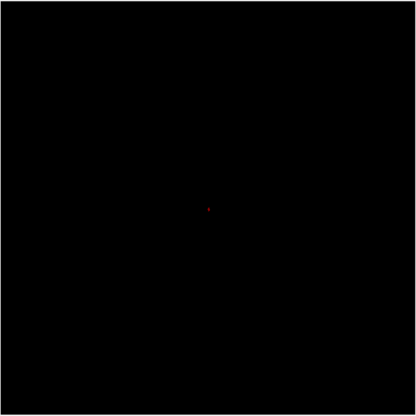

# Design
Different colourful designs using turtle module with python coding
# 🎨 Design Repository

Welcome to the **Design** repository!  
This project showcases a vibrant collection of colourful designs and patterns created using the Python Turtle module. Explore basic geometric shapes, cute animals, floral arrangements, and mesmerizing mandala patterns—each with a unique twist and burst of colour! 🌈✨

---

## 🗂️ Folder Structure

| Folder / File                | Description                                                    |
|------------------------------|----------------------------------------------------------------|
| [`Design-Repository/`](#design-repository) | 🎨 Colourful designs using the Turtle module                     |
| [`Animal/`](#animal)         | 🐾 Cute cartoon animal designs                                 |
| [`Basic_Design/`](#Basic_Design) | 📐 Basic geometric shapes and patterns                         |
| [`FlowerPot/`](#FlowerPot)   | 🌷 Beautiful flower and flower pot designs                     |
| [`Geometric_Patterns/`](#Geometric_Patterns) | 🎊 Colourful rangoli & mandala patterns                         |

---

## 📂 Folder and File Overview

### `Design-Repository/`
- **A collection of different colourful designs created with Python's Turtle module.**

---

### `Animal/` 🐾
- **Cat.py** 🐱: Cute cat cartoon design.
- **Mouse.py** 🐭: Cute mouse cartoon design.
- **Rabbit.py** 🐰: Cute rabbit cartoon design.

---

### `Basic_Design/` 📐
- **Circle.py** 🟠: Simple circle.
- **Triangle.py** 🔺: Simple triangle.
- **Quardilateral.py** 🟥: Squares and rectangles.
- **Pentagon.py** 🔵: Simple pentagon.
- **Hexagon.py** 🔶: Simple hexagon.
- **Hexagon(1).py** ➕: Hexagon with one extended side.
- **Hexagon(2).py** ➕: Hexagon with two parallel extended sides.
- **Hexagon_Colour_Design.py** 🌈: Coloured triangle and hexagon.
- **Circle_Design.py** 🌈: Colourful circle pattern.
- **Heptagon.py** ⬣: Simple heptagon.
- **Octagon.py** ⬢: Simple octagon.
- **Nonagon.py** ⬟: Simple nonagon.

---

### `FlowerPot/` 🌷
- **Flower.py** 🌼: Simple flower design.
- **Flower_Pot.py** 🪴: Flower pot with leaf (minimal colours).
- **Flower_Pot(1).py** 🌺: Flower pot with 2 leaves and max colours.

---

### `Geometric_Patterns/` 🎊
- **Circle_Rangoli.py** 🌀: Concentric colourful filled and outlined circles.
- **Geometric_Rangoli.py** 🎨: Petal and polygon-based rangoli.
- **golden_spiral_drawer.py** 🌈: Spiral using the golden angle.
- **Pyramid.py** 🔺: Spiral triangle with RGB transitions.
- **Quadrilateral_Pattern.py** 🟪: Rotated square rings with HSV colours.
- **Quadrilateral_Spiral.py** 🔲: Expanding quadrilateral spiral with RGB transitions.
- **Rangoli_Pattern.py** 💠: Interactive rangoli with 6 vibrant patterns.
- **Spectrum_Petal_Dance.py** 🌸: Multi-layered rainbow petal mandala.
- **Square_Pattern.py** 🟥: Rotated squares in gradient hues.
- **Triangle_flower_pettle_pattern.py** 🌼: Triangle-based floral mandala.
- **Triangle_Rangoli.py** 🔻: Concentric triangle rings with flower-like center.

---

## ✨ Live Preview (Animation)

> **All designs use Python's [Turtle](https://docs.python.org/3/library/turtle.html) module.  
> Run any `.py` file to see the animated drawing process!**

 

**Sample Animated Output from `Geometric_Patterns/Quadrilateral_Spiral.py`:**

_Expanding quadrilateral spiral with vibrant colour transitions._

---

## 🤗 Contribute

Pull requests are welcome!  
If you have ideas for new patterns or want to enhance the existing ones, feel free to contribute.

---

## ⭐️ Give a Star!

If you like this repository, please ⭐️ it on [GitHub](https://github.com/Dhrumi45/Design)!

---

Happy designing! 🎨🐢🌈

